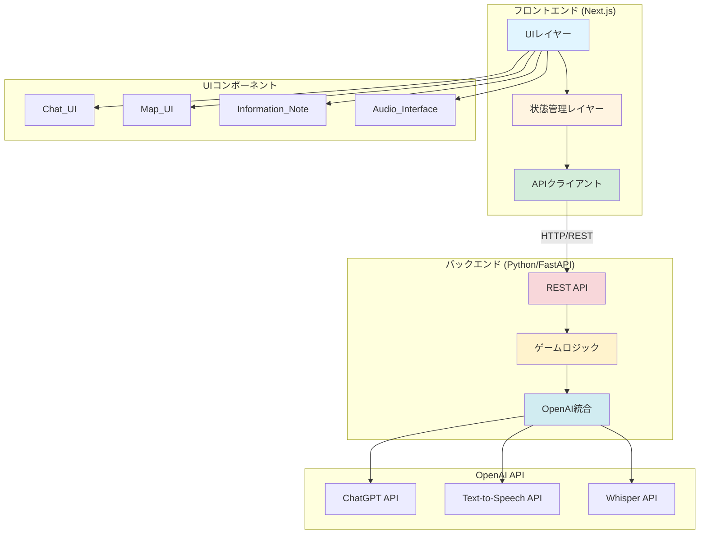
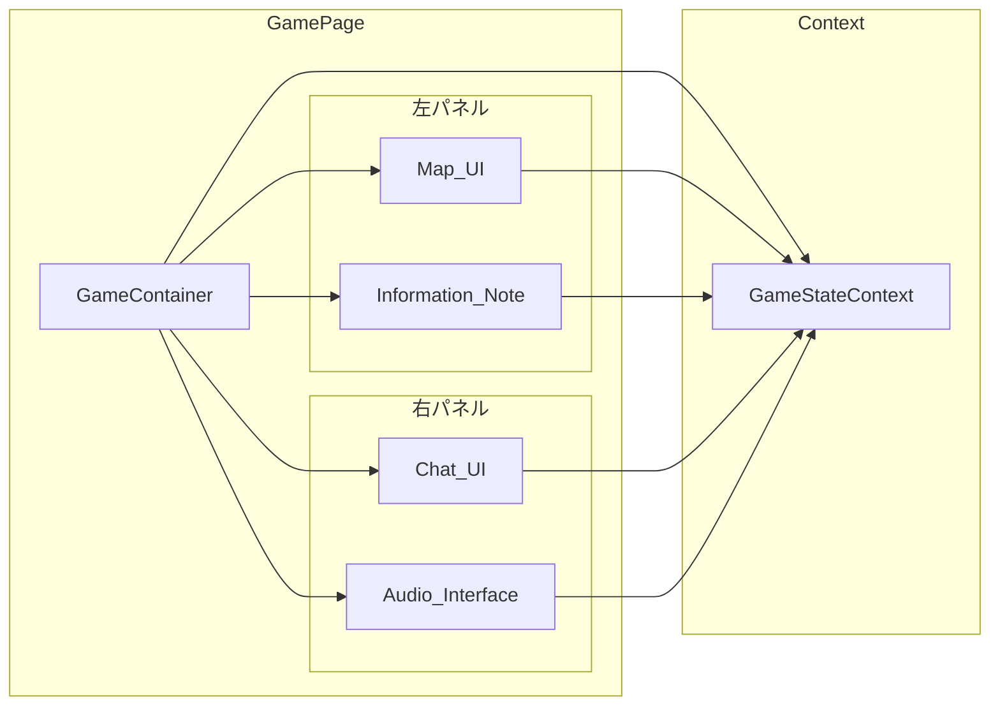
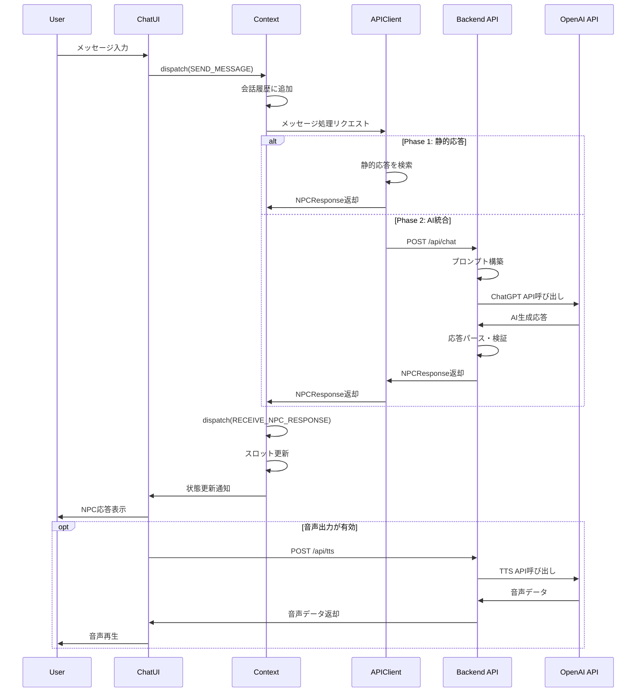

# 設計ドキュメント

## 概要

サバイバル英語ロールプレイゲームは、Next.js（フロントエンド）とPython（バックエンド）で構成されるWebアプリケーションとして実装されます。本システムは、英語初心者が「伝わること」を重視した会話体験を通じて、マップ上の目的地を目指すインタラクティブな学習ゲームです。

### 主要な設計目標

- **フロントエンド・バックエンド分離**: Next.jsとPythonの独立したプロジェクト構成
- **コンテナ化された開発環境**: Docker/.devcontainerによるクリーンな開発環境
- **シンプルな状態管理**: ステートマシンベースの明確な進行フロー
- **段階的な実装**: Phase 1（静的プロトタイプ）からPhase 2（AI統合）への移行可能な設計
- **コンポーネント分離**: UI、状態管理、AI統合の明確な責任分離
- **音声対応**: OpenAI APIを使用したテキストと音声の両方の入力/出力をサポート

### アーキテクチャ原則

1. **マイクロサービス指向**: フロントエンドとバックエンドの完全な分離
2. **型安全性**: TypeScript（フロントエンド）とPython型ヒント（バックエンド）による厳密な型定義
3. **段階的拡張**: Phase 1では静的データ、Phase 2でOpenAI API統合
4. **状態の一元管理**: React Context + useReducerによる予測可能な状態更新
5. **開発環境の一貫性**: .devcontainerによる再現可能な開発環境

## 開発環境

### Docker/.devcontainer構成

本プロジェクトは、ローカル環境を汚さず、チーム全体で一貫した開発環境を提供するために、Docker Composeと.devcontainerを使用します。

#### プロジェクト構造

```
survival-english-roleplay/
├── .devcontainer/
│   ├── devcontainer.json          # VS Code Dev Container設定
│   └── docker-compose.yml         # 開発環境のDocker Compose設定
├── frontend/                      # Next.jsフロントエンド
│   ├── Dockerfile
│   ├── package.json
│   └── ...
└── backend/                       # Pythonバックエンド
    ├── Dockerfile
    ├── requirements.txt
    └── ...
```

#### Docker Compose構成

```yaml
# .devcontainer/docker-compose.yml
version: '3.8'

services:
  frontend:
    build:
      context: ../frontend
      dockerfile: Dockerfile
    ports:
      - "3000:3000"
    volumes:
      - ../frontend:/app
      - /app/node_modules
    environment:
      - NODE_ENV=development
      - NEXT_PUBLIC_API_URL=http://backend:8000
    command: npm run dev
    depends_on:
      - backend

  backend:
    build:
      context: ../backend
      dockerfile: Dockerfile
    ports:
      - "8000:8000"
    volumes:
      - ../backend:/app
    environment:
      - PYTHONUNBUFFERED=1
      - OPENAI_API_KEY=${OPENAI_API_KEY}
    command: uvicorn main:app --host 0.0.0.0 --port 8000 --reload
```

#### フロントエンドDockerfile

```dockerfile
# frontend/Dockerfile
FROM node:18-alpine

WORKDIR /app

COPY package*.json ./
RUN npm ci

COPY . .

EXPOSE 3000

CMD ["npm", "run", "dev"]
```

#### バックエンドDockerfile

```dockerfile
# backend/Dockerfile
FROM python:3.11-slim

WORKDIR /app

COPY requirements.txt .
RUN pip install --no-cache-dir -r requirements.txt

COPY . .

EXPOSE 8000

CMD ["uvicorn", "main:app", "--host", "0.0.0.0", "--port", "8000", "--reload"]
```

#### .devcontainer設定

```json
// .devcontainer/devcontainer.json
{
  "name": "Survival English Roleplay",
  "dockerComposeFile": "docker-compose.yml",
  "service": "frontend",
  "workspaceFolder": "/app",
  "customizations": {
    "vscode": {
      "extensions": [
        "dbaeumer.vscode-eslint",
        "esbenp.prettier-vscode",
        "ms-python.python",
        "ms-python.vscode-pylance"
      ]
    }
  },
  "forwardPorts": [3000, 8000],
  "postCreateCommand": "npm install"
}
```

### 環境変数管理

```bash
# .env.example（バックエンド）
OPENAI_API_KEY=your_openai_api_key_here
OPENAI_MODEL=gpt-4
OPENAI_TTS_MODEL=tts-1
OPENAI_TTS_VOICE=alloy
OPENAI_WHISPER_MODEL=whisper-1
```

```bash
# frontend/.env.local.example
NEXT_PUBLIC_API_URL=http://localhost:8000
```

## アーキテクチャ

### システム構成図



### レイヤー構成

#### フロントエンド（Next.js）

##### 1. UIレイヤー
- **責任**: ユーザーインタラクションとビジュアル表示
- **技術**: React Server Components + Client Components
- **コンポーネント**: Chat_UI, Map_UI, Information_Note, Audio_Interface

##### 2. 状態管理レイヤー
- **責任**: ゲーム状態の管理と更新ロジック
- **技術**: React Context API + useReducer
- **管理対象**: 現在のState、Required_Slot、会話履歴、ペナルティ状態

##### 3. APIクライアントレイヤー
- **責任**: バックエンドAPIとの通信
- **技術**: Fetch API / Axios
- **Phase 1**: 静的データの読み込み
- **Phase 2**: バックエンドAPIへのHTTPリクエスト

#### バックエンド（Python/FastAPI）

##### 1. REST APIレイヤー
- **責任**: HTTPエンドポイントの提供とリクエスト処理
- **技術**: FastAPI
- **機能**: CORS設定、リクエスト検証、エラーハンドリング

##### 2. ゲームロジックレイヤー
- **責任**: ゲームルール、State遷移、スロット管理
- **技術**: Python（Pydanticモデル）
- **機能**: シナリオ管理、応答生成、ペナルティ計算

##### 3. OpenAI統合レイヤー
- **責任**: OpenAI APIとの通信
- **技術**: OpenAI Python SDK
- **機能**: 
  - ChatGPT APIによる会話生成
  - Whisper APIによる音声認識（Speech-to-Text）
  - TTS APIによる音声合成（Text-to-Speech）

## コンポーネントとインターフェース

### コンポーネント構成



### 主要コンポーネント

#### 1. GameContainer
**責任**: ゲーム全体のレイアウトと状態プロバイダー

```typescript
// app/game/page.tsx
export default function GamePage() {
  return (
    <GameStateProvider>
      <div className="game-container">
        <aside className="left-panel">
          <MapUI />
          <InformationNote />
        </aside>
        <main className="right-panel">
          <ChatUI />
          <AudioInterface />
        </main>
      </div>
    </GameStateProvider>
  );
}
```

**Props**: なし（ルートコンポーネント）

**State**: GameStateContextを提供

---

#### 2. Map_UI
**責任**: 現在地と進行状況の視覚的表示

```typescript
interface MapUIProps {
  // Contextから状態を取得するため、propsは不要
}

// 内部で使用する型
interface StateNode {
  id: string;
  name: string;
  position: { x: number; y: number };
  isGoal: boolean;
  isError: boolean;
}
```

**機能**:
- 全Stateをマップ上に表示
- 現在のStateをハイライト
- ゴールStateを特別なアイコンで表示
- State間の接続線を表示

**実装方針**:
- SVGまたはCanvas要素を使用
- レスポンシブデザイン対応
- アニメーション効果（State遷移時）

---

#### 3. Information_Note
**責任**: 収集した情報の表示と進捗管理

```typescript
interface InformationNoteProps {
  // Contextから状態を取得
}

interface SlotDisplay {
  slotName: string;
  label: string;
  value: string | null;
  isFilled: boolean;
}
```

**機能**:
- Required_Slotの一覧表示
- 埋まっているスロットと空のスロットの視覚的区別
- スロット値の表示

**UI要素**:
- チェックボックス風のアイコン（埋まっている/空）
- スロット名とラベル
- 収集した情報の値

---

#### 4. Chat_UI
**責任**: AI NPCとの会話インターフェース

```typescript
interface ChatUIProps {
  // Contextから状態を取得
}

interface Message {
  id: string;
  role: 'user' | 'npc';
  content: string;
  timestamp: Date;
}
```

**機能**:
- 会話履歴のスクロール表示
- メッセージの送信
- NPCメッセージの表示
- 移動選択肢の表示（ボタン形式）
- 固定高さコンテナ内でのスクロール制御

**UI要素**:
- 固定ヘッダー（NPC役割表示）
- メッセージリスト（スクロール可能、固定高さ内）
- テキスト入力フィールド（固定フッター）
- 送信ボタン
- 移動選択肢ボタン群

**レイアウト設計**:
- Chat UIは固定高さ（700px）のコンテナ
- ヘッダーと入力フォームは固定位置
- メッセージリストのみがスクロール可能
- 会話が長くなってもMap UIとInformation Noteが常に見える位置に固定
- Flexboxを使用した3層構造（ヘッダー / メッセージリスト / 入力フォーム）

---

#### 5. Audio_Interface
**責任**: 音声入力と音声出力の制御

```typescript
interface AudioInterfaceProps {
  // Contextから状態を取得
}

interface AudioState {
  isRecording: boolean;
  isProcessing: boolean;
  voiceOutputEnabled: boolean;
  isSpeaking: boolean;
}
```

**機能**:
- マイクボタン（音声入力の開始/停止）
- 音声認識の状態表示
- 音声出力のオン/オフ切り替え
- 音声再生中の表示

**Phase 1実装**:
- UIのみ実装（ボタンとステータス表示）
- 実際の音声機能はPhase 2で実装

**Phase 2実装**:
- Web Speech API（Speech Recognition）
- Web Speech API（Speech Synthesis）またはサードパーティTTS

---

### コンポーネント間の通信

すべてのコンポーネントは`GameStateContext`を通じて状態を共有します。

```typescript
// contexts/GameStateContext.tsx
interface GameState {
  scenario: Scenario;
  currentStateId: string;
  requiredSlots: Record<string, string | null>;
  conversationHistory: Message[];
  movementOptions: MovementOption[] | null;
  penaltyState: PenaltyState;
  audioState: AudioState;
}

type GameAction =
  | { type: 'SEND_MESSAGE'; payload: { content: string } }
  | { type: 'RECEIVE_NPC_RESPONSE'; payload: NPCResponse }
  | { type: 'UPDATE_SLOTS'; payload: Record<string, string> }
  | { type: 'SHOW_MOVEMENT_OPTIONS'; payload: MovementOption[] }
  | { type: 'SELECT_MOVEMENT'; payload: string }
  | { type: 'TRANSITION_STATE'; payload: { newStateId: string } }
  | { type: 'APPLY_PENALTY'; payload: PenaltyType }
  | { type: 'TOGGLE_VOICE_OUTPUT' }
  | { type: 'SET_RECORDING'; payload: boolean };

const GameStateContext = createContext<{
  state: GameState;
  dispatch: Dispatch<GameAction>;
} | null>(null);
```

## データモデル

### 主要なデータ構造

#### 1. Scenario（シナリオ）

```typescript
interface Scenario {
  id: string;
  name: string;
  description: string;
  startStateId: string;
  goalStateId: string;
  states: Record<string, State>;
}
```

**説明**: ゲーム全体のシナリオ定義。自由の女神シナリオでは、JFK空港から自由の女神までの旅を定義します。

**例**:
```typescript
const statueLibertyScenario: Scenario = {
  id: 'statue-of-liberty',
  name: '自由の女神への旅',
  description: 'JFK空港から自由の女神を目指す',
  startStateId: 'airport-lobby',
  goalStateId: 'statue-of-liberty',
  states: {
    'airport-lobby': { /* ... */ },
    'city-transit': { /* ... */ },
    // ...
  }
};
```

---

#### 2. State（状態/地点）

```typescript
interface State {
  id: string;
  name: string;
  description: string;
  npcRole: string; // 例: "空港スタッフ", "タクシー運転手"
  isGoal: boolean;
  isError: boolean;
  requiredSlots: string[]; // 次に進むために必要な情報
  transitions: StateTransition[];
  mapPosition: { x: number; y: number }; // マップ上の座標
}

interface StateTransition {
  targetStateId: string;
  requiredSlotValues?: Record<string, string>; // 正しい値の条件
  label: string; // 移動選択肢のラベル
}
```

**説明**: マップ上の特定の地点または状況。各Stateには、NPCの役割、必要な情報スロット、可能な遷移先が定義されます。

**例**:
```typescript
const airportLobbyState: State = {
  id: 'airport-lobby',
  name: '空港ロビー',
  description: 'JFK空港の到着ロビー',
  npcRole: '空港インフォメーションスタッフ',
  isGoal: false,
  isError: false,
  requiredSlots: ['destination', 'transport'],
  transitions: [
    {
      targetStateId: 'city-transit',
      requiredSlotValues: {
        destination: 'Statue of Liberty',
        transport: 'subway'
      },
      label: '地下鉄で市内へ'
    },
    {
      targetStateId: 'wrong-place',
      label: 'タクシーで直接向かう'
    }
  ],
  mapPosition: { x: 100, y: 100 }
};
```

---

#### 3. Message（メッセージ）

```typescript
interface Message {
  id: string;
  role: 'user' | 'npc';
  content: string;
  timestamp: Date;
}
```

**説明**: チャット履歴の個別メッセージ。

---

#### 4. NPCResponse（NPC応答）

```typescript
interface NPCResponse {
  npcMessage: string;
  slotUpdates?: Record<string, string>; // 更新されたスロット
  movementOptions?: MovementOption[]; // 提示する移動選択肢
  shouldTransition?: boolean; // State遷移が可能か
}

interface MovementOption {
  id: string;
  label: string;
  targetStateId: string;
  isCorrect: boolean; // 正しい選択肢かどうか
}
```

**説明**: NPCからの応答データ。Phase 1では静的JSON、Phase 2ではAI生成。

**Phase 1の例**:
```typescript
// data/staticResponses.ts
const airportLobbyResponses: Record<string, NPCResponse> = {
  'initial': {
    npcMessage: "Hello! Welcome to JFK Airport. How can I help you today?",
    slotUpdates: {},
    movementOptions: null
  },
  'statue': {
    npcMessage: "Ah, the Statue of Liberty! You'll need to take the subway to Battery Park, then catch a ferry.",
    slotUpdates: {
      destination: 'Statue of Liberty',
      transport: 'subway',
      landmark: 'Battery Park'
    },
    movementOptions: [
      {
        id: 'subway',
        label: '地下鉄で市内へ',
        targetStateId: 'city-transit',
        isCorrect: true
      },
      {
        id: 'taxi',
        label: 'タクシーで直接向かう',
        targetStateId: 'wrong-place',
        isCorrect: false
      }
    ]
  }
};
```

---

#### 5. GameSession（ゲームセッション）

```typescript
interface GameSession {
  sessionId: string;
  scenarioId: string;
  currentStateId: string;
  requiredSlots: Record<string, string | null>;
  conversationHistory: Message[];
  penaltyState: PenaltyState;
  startTime: Date;
  completedAt?: Date;
  isCompleted: boolean;
}

interface PenaltyState {
  lives: number;
  maxLives: number;
  hintsUsed: number;
  wrongMoves: number;
}
```

**説明**: 現在のゲームプレイセッションの状態。Phase 1ではブラウザのメモリ内、Phase 2ではlocalStorageまたはバックエンドに保存。

---

### データフロー



---

### Phase 1の静的データ構造

Phase 1では、以下のファイル構成で静的データを管理します：

```
frontend/
├── data/
│   ├── scenarios/
│   │   └── statueLibertyScenario.ts    # シナリオ定義
│   ├── states/
│   │   ├── airportLobby.ts              # 各State定義
│   │   ├── cityTransit.ts
│   │   ├── batteryParkArea.ts
│   │   ├── ferryTerminal.ts
│   │   ├── statueOfLiberty.ts
│   │   └── wrongPlace.ts
│   └── staticResponses/
│       ├── airportLobbyResponses.ts     # 各Stateの静的応答
│       ├── cityTransitResponses.ts
│       └── ...
```

各静的応答ファイルは、ユーザー入力のキーワードに基づいて適切な応答を返すマッピングを提供します。

```typescript
// frontend/data/staticResponses/airportLobbyResponses.ts
export const airportLobbyResponses: Record<string, NPCResponse> = {
  'default': {
    npcMessage: "Hello! How can I help you?",
  },
  'statue|liberty': {
    npcMessage: "The Statue of Liberty! Take the subway to Battery Park.",
    slotUpdates: {
      destination: 'Statue of Liberty',
      transport: 'subway'
    }
  },
  // ... 他のパターン
};
```

## バックエンドAPI設計

### 技術スタック

- **フレームワーク**: FastAPI（高速、型安全、自動ドキュメント生成）
- **OpenAI SDK**: openai-python
- **検証**: Pydantic v2
- **CORS**: FastAPI CORSMiddleware

### プロジェクト構造

```
backend/
├── main.py                    # FastAPIアプリケーションエントリーポイント
├── requirements.txt           # Python依存関係
├── Dockerfile
├── api/
│   ├── __init__.py
│   ├── chat.py               # チャットエンドポイント
│   ├── tts.py                # Text-to-Speechエンドポイント
│   └── stt.py                # Speech-to-Textエンドポイント
├── models/
│   ├── __init__.py
│   ├── game.py               # ゲームデータモデル
│   └── openai_models.py      # OpenAI関連モデル
├── services/
│   ├── __init__.py
│   ├── game_logic.py         # ゲームロジック
│   └── openai_service.py     # OpenAI API統合
└── config.py                 # 設定管理
```

### エンドポイント設計

#### 1. POST /api/chat - 会話処理

**リクエスト**:
```python
# models/game.py
from pydantic import BaseModel
from typing import List, Dict, Optional

class Message(BaseModel):
    id: str
    role: str  # 'user' | 'npc'
    content: str
    timestamp: str

class ChatRequest(BaseModel):
    session_id: str
    state_id: str
    user_message: str
    conversation_history: List[Message]
    current_slots: Dict[str, Optional[str]]
```

**レスポンス**:
```python
class MovementOption(BaseModel):
    id: str
    label: str
    target_state_id: str
    is_correct: bool

class NPCResponse(BaseModel):
    npc_message: str
    slot_updates: Optional[Dict[str, str]] = None
    movement_options: Optional[List[MovementOption]] = None
    should_transition: bool = False

class ChatResponse(BaseModel):
    success: bool
    data: Optional[NPCResponse] = None
    error: Optional[str] = None
```

**実装例**:
```python
# api/chat.py
from fastapi import APIRouter, HTTPException
from models.game import ChatRequest, ChatResponse, NPCResponse
from services.openai_service import OpenAIService
from services.game_logic import GameLogic

router = APIRouter()
openai_service = OpenAIService()
game_logic = GameLogic()

@router.post("/chat", response_model=ChatResponse)
async def process_chat(request: ChatRequest):
    try:
        # ゲームロジックでプロンプトを構築
        prompt = game_logic.build_npc_prompt(
            state_id=request.state_id,
            slots=request.current_slots,
            history=request.conversation_history
        )
        
        # OpenAI ChatGPT APIを呼び出し
        ai_response = await openai_service.generate_npc_response(
            prompt=prompt,
            user_message=request.user_message
        )
        
        # 応答をパースして検証
        npc_response = game_logic.parse_ai_response(ai_response)
        
        return ChatResponse(success=True, data=npc_response)
    
    except Exception as e:
        return ChatResponse(
            success=False,
            error=str(e)
        )
```

---

#### 2. POST /api/tts - Text-to-Speech

**リクエスト**:
```python
class TTSRequest(BaseModel):
    text: str
    voice: str = "alloy"  # alloy, echo, fable, onyx, nova, shimmer
    speed: float = 1.0
```

**レスポンス**:
```python
# 音声データ（audio/mpeg）をバイナリで返却
# Content-Type: audio/mpeg
```

**実装例**:
```python
# api/tts.py
from fastapi import APIRouter
from fastapi.responses import StreamingResponse
from models.openai_models import TTSRequest
from services.openai_service import OpenAIService

router = APIRouter()
openai_service = OpenAIService()

@router.post("/tts")
async def text_to_speech(request: TTSRequest):
    try:
        # OpenAI TTS APIを呼び出し
        audio_stream = await openai_service.generate_speech(
            text=request.text,
            voice=request.voice,
            speed=request.speed
        )
        
        return StreamingResponse(
            audio_stream,
            media_type="audio/mpeg"
        )
    
    except Exception as e:
        raise HTTPException(status_code=500, detail=str(e))
```

---

#### 3. POST /api/stt - Speech-to-Text

**リクエスト**:
```python
# multipart/form-data
# audio: UploadFile（音声ファイル）
```

**レスポンス**:
```python
class STTResponse(BaseModel):
    success: bool
    text: Optional[str] = None
    error: Optional[str] = None
```

**実装例**:
```python
# api/stt.py
from fastapi import APIRouter, UploadFile, File
from models.openai_models import STTResponse
from services.openai_service import OpenAIService

router = APIRouter()
openai_service = OpenAIService()

@router.post("/stt", response_model=STTResponse)
async def speech_to_text(audio: UploadFile = File(...)):
    try:
        # OpenAI Whisper APIを呼び出し
        transcript = await openai_service.transcribe_audio(audio.file)
        
        return STTResponse(success=True, text=transcript)
    
    except Exception as e:
        return STTResponse(success=False, error=str(e))
```

---

### OpenAI API統合

#### OpenAIServiceクラス

```python
# services/openai_service.py
from openai import AsyncOpenAI
from typing import List, Dict, BinaryIO
import os

class OpenAIService:
    def __init__(self):
        self.client = AsyncOpenAI(api_key=os.getenv("OPENAI_API_KEY"))
        self.chat_model = os.getenv("OPENAI_MODEL", "gpt-4")
        self.tts_model = os.getenv("OPENAI_TTS_MODEL", "tts-1")
        self.tts_voice = os.getenv("OPENAI_TTS_VOICE", "alloy")
        self.whisper_model = os.getenv("OPENAI_WHISPER_MODEL", "whisper-1")
    
    async def generate_npc_response(
        self,
        prompt: str,
        user_message: str
    ) -> str:
        """ChatGPT APIを使用してNPC応答を生成"""
        try:
            response = await self.client.chat.completions.create(
                model=self.chat_model,
                messages=[
                    {"role": "system", "content": prompt},
                    {"role": "user", "content": user_message}
                ],
                temperature=0.7,
                max_tokens=500,
                response_format={"type": "json_object"}
            )
            
            return response.choices[0].message.content
        
        except Exception as e:
            raise Exception(f"OpenAI Chat API error: {str(e)}")
    
    async def generate_speech(
        self,
        text: str,
        voice: str = "alloy",
        speed: float = 1.0
    ):
        """OpenAI TTS APIを使用して音声を生成"""
        try:
            response = await self.client.audio.speech.create(
                model=self.tts_model,
                voice=voice,
                input=text,
                speed=speed
            )
            
            return response.iter_bytes()
        
        except Exception as e:
            raise Exception(f"OpenAI TTS API error: {str(e)}")
    
    async def transcribe_audio(self, audio_file: BinaryIO) -> str:
        """OpenAI Whisper APIを使用して音声をテキストに変換"""
        try:
            transcript = await self.client.audio.transcriptions.create(
                model=self.whisper_model,
                file=audio_file,
                language="en"
            )
            
            return transcript.text
        
        except Exception as e:
            raise Exception(f"OpenAI Whisper API error: {str(e)}")
```

#### プロンプト構築ロジック

```python
# services/game_logic.py
from typing import Dict, List, Optional
from models.game import Message, State

class GameLogic:
    def build_npc_prompt(
        self,
        state_id: str,
        slots: Dict[str, Optional[str]],
        history: List[Message]
    ) -> str:
        """ゲーム状態に基づいてNPCプロンプトを構築"""
        
        # Stateデータを取得（実際にはデータベースまたは設定から）
        state = self._get_state(state_id)
        
        prompt = f"""
You are a {state.npc_role} at {state.name}.
You are helping a beginner English learner who is trying to reach their destination.

Current information collected:
{self._format_slots(slots, state.required_slots)}

Required information to proceed:
{', '.join(state.required_slots)}

Guidelines:
- Be friendly and patient
- Accept broken English and single words
- Help the user discover the required information naturally through conversation
- When user mentions information related to required slots, update slot_updates in your response
- Do not correct grammar during roleplay
- CRITICAL: Only offer movement_options when ALL required slots are filled (no null values)
- Check that every required slot has a value before offering movement options
- Guide them towards the CORRECT path

Respond in JSON format:
{{
  "npc_message": "your response here",
  "slot_updates": {{"slot_name": "value"}},
  "movement_options": [
    {{"id": "option1", "label": "Option 1", "target_state_id": "state-id", "is_correct": true}}
  ],
  "should_transition": false
}}

CRITICAL VALIDATION BEFORE RESPONDING:
- Only offer movement_options when ALL required slots have values
- If any required slot is "not yet collected", do NOT include movement_options in your response
- Verify movement options do not loop back to current state

Conversation history:
{self._format_history(history)}
"""
        return prompt
    
    def validate_slots_complete(
        self,
        state_id: str,
        slots: Dict[str, Optional[str]]
    ) -> bool:
        """スロットが全て埋まっているかチェック"""
        state = self._get_state(state_id)
        required_slots = state.required_slots
        
        # 必須スロットがない場合（ゴールStateなど）
        if not required_slots:
            return True
        
        # 全ての必須スロットが埋まっているかチェック
        for slot in required_slots:
            value = slots.get(slot)
            if value is None or value == "":
                return False
        
        return True
    
    def _format_slots(
        self,
        slots: Dict[str, Optional[str]],
        required_slots: List[str]
    ) -> str:
        """スロット情報をフォーマット"""
        lines = []
        for slot in required_slots:
            value = slots.get(slot, None)
            status = value if value else "not yet collected"
            lines.append(f"- {slot}: {status}")
        return "\n".join(lines)
    
    def _format_history(self, history: List[Message]) -> str:
        """会話履歴をフォーマット"""
        return "\n".join([
            f"{msg.role}: {msg.content}"
            for msg in history[-5:]  # 最新5件のみ
        ])
    
    def parse_ai_response(self, ai_response: str) -> NPCResponse:
        """AI応答をパースして検証"""
        import json
        
        try:
            data = json.loads(ai_response)
            
            # 必須フィールドの検証
            if "npc_message" not in data:
                raise ValueError("Missing npc_message field")
            
            return NPCResponse(
                npc_message=data["npc_message"],
                slot_updates=data.get("slot_updates"),
                movement_options=data.get("movement_options"),
                should_transition=data.get("should_transition", False)
            )
        
        except json.JSONDecodeError as e:
            raise ValueError(f"Invalid JSON response: {str(e)}")
```

#### FastAPIメインアプリケーション

```python
# main.py
from fastapi import FastAPI
from fastapi.middleware.cors import CORSMiddleware
from api import chat, tts, stt

app = FastAPI(
    title="Survival English Roleplay API",
    description="Backend API for Survival English Roleplay Game",
    version="1.0.0"
)

# CORS設定
app.add_middleware(
    CORSMiddleware,
    allow_origins=["http://localhost:3000"],  # フロントエンドのURL
    allow_credentials=True,
    allow_methods=["*"],
    allow_headers=["*"],
)

# ルーターの登録
app.include_router(chat.router, prefix="/api", tags=["chat"])
app.include_router(tts.router, prefix="/api", tags=["tts"])
app.include_router(stt.router, prefix="/api", tags=["stt"])

@app.get("/")
async def root():
    return {"message": "Survival English Roleplay API"}

@app.get("/health")
async def health_check():
    return {"status": "healthy"}
```

#### requirements.txt

```txt
fastapi==0.109.0
uvicorn[standard]==0.27.0
openai==1.10.0
pydantic==2.5.3
python-multipart==0.0.6
python-dotenv==1.0.0
```

### フロントエンドAPIクライアント

```typescript
// frontend/lib/apiClient.ts
const API_BASE_URL = process.env.NEXT_PUBLIC_API_URL || 'http://localhost:8000';

export interface ChatRequest {
  sessionId: string;
  stateId: string;
  userMessage: string;
  conversationHistory: Message[];
  currentSlots: Record<string, string | null>;
}

export interface ChatResponse {
  success: boolean;
  data?: NPCResponse;
  error?: string;
}

export class APIClient {
  async sendMessage(request: ChatRequest): Promise<ChatResponse> {
    const response = await fetch(`${API_BASE_URL}/api/chat`, {
      method: 'POST',
      headers: {
        'Content-Type': 'application/json',
      },
      body: JSON.stringify(request),
    });
    
    if (!response.ok) {
      throw new Error(`API error: ${response.status}`);
    }
    
    return response.json();
  }
  
  async textToSpeech(text: string, voice: string = 'alloy'): Promise<Blob> {
    const response = await fetch(`${API_BASE_URL}/api/tts`, {
      method: 'POST',
      headers: {
        'Content-Type': 'application/json',
      },
      body: JSON.stringify({ text, voice }),
    });
    
    if (!response.ok) {
      throw new Error(`TTS API error: ${response.status}`);
    }
    
    return response.blob();
  }
  
  async speechToText(audioBlob: Blob): Promise<string> {
    const formData = new FormData();
    formData.append('audio', audioBlob, 'audio.webm');
    
    const response = await fetch(`${API_BASE_URL}/api/stt`, {
      method: 'POST',
      body: formData,
    });
    
    if (!response.ok) {
      throw new Error(`STT API error: ${response.status}`);
    }
    
    const data = await response.json();
    
    if (!data.success) {
      throw new Error(data.error || 'STT failed');
    }
    
    return data.text;
  }
}

export const apiClient = new APIClient();
```

## 音声機能の設計

### 音声入力（Speech-to-Text）

#### Phase 1実装
- UIのみ実装（マイクボタンと状態表示）
- ボタンクリックで「音声入力は開発中です」というメッセージを表示

#### Phase 2実装

**技術選択**: 
- **ブラウザ側**: MediaRecorder APIで音声を録音
- **バックエンド**: OpenAI Whisper APIで音声認識

```typescript
// frontend/hooks/useSpeechRecognition.ts
export function useSpeechRecognition() {
  const [isRecording, setIsRecording] = useState(false);
  const [transcript, setTranscript] = useState('');
  const mediaRecorderRef = useRef<MediaRecorder | null>(null);
  const audioChunksRef = useRef<Blob[]>([]);
  
  const startRecording = async () => {
    try {
      const stream = await navigator.mediaDevices.getUserMedia({ audio: true });
      const mediaRecorder = new MediaRecorder(stream);
      
      mediaRecorderRef.current = mediaRecorder;
      audioChunksRef.current = [];
      
      mediaRecorder.ondataavailable = (event) => {
        audioChunksRef.current.push(event.data);
      };
      
      mediaRecorder.onstop = async () => {
        const audioBlob = new Blob(audioChunksRef.current, { type: 'audio/webm' });
        
        try {
          // バックエンドのWhisper APIに送信
          const text = await apiClient.speechToText(audioBlob);
          setTranscript(text);
        } catch (error) {
          console.error('Speech recognition error:', error);
        }
        
        // ストリームを停止
        stream.getTracks().forEach(track => track.stop());
      };
      
      mediaRecorder.start();
      setIsRecording(true);
    } catch (error) {
      console.error('Failed to start recording:', error);
    }
  };
  
  const stopRecording = () => {
    if (mediaRecorderRef.current && isRecording) {
      mediaRecorderRef.current.stop();
      setIsRecording(false);
    }
  };
  
  return {
    isRecording,
    transcript,
    startRecording,
    stopRecording,
    isSupported: typeof navigator !== 'undefined' && !!navigator.mediaDevices
  };
}
```

**使用例**:
```typescript
// components/AudioInterface.tsx
const { isRecording, transcript, startRecording, stopRecording, isSupported } = 
  useSpeechRecognition();

useEffect(() => {
  if (transcript) {
    // 認識されたテキストをチャット入力に設定
    dispatch({ type: 'SEND_MESSAGE', payload: { content: transcript } });
  }
}, [transcript]);
```

### 音声出力（Text-to-Speech）

#### Phase 1実装
- UIのみ実装（スピーカーアイコンとオン/オフトグル）
- 実際の音声再生は行わない

#### Phase 2実装

**技術選択**: OpenAI TTS API

```typescript
// frontend/hooks/useTextToSpeech.ts
export function useTextToSpeech() {
  const [isSpeaking, setIsSpeaking] = useState(false);
  const [isEnabled, setIsEnabled] = useState(true);
  const audioRef = useRef<HTMLAudioElement | null>(null);
  
  const speak = useCallback(async (text: string) => {
    if (!isEnabled) return;
    
    try {
      setIsSpeaking(true);
      
      // バックエンドのTTS APIを呼び出し
      const audioBlob = await apiClient.textToSpeech(text, 'alloy');
      const audioUrl = URL.createObjectURL(audioBlob);
      
      // 音声を再生
      const audio = new Audio(audioUrl);
      audioRef.current = audio;
      
      audio.onended = () => {
        setIsSpeaking(false);
        URL.revokeObjectURL(audioUrl);
      };
      
      audio.onerror = () => {
        setIsSpeaking(false);
        URL.revokeObjectURL(audioUrl);
      };
      
      await audio.play();
    } catch (error) {
      console.error('Text-to-speech error:', error);
      setIsSpeaking(false);
    }
  }, [isEnabled]);
  
  const stop = useCallback(() => {
    if (audioRef.current) {
      audioRef.current.pause();
      audioRef.current = null;
      setIsSpeaking(false);
    }
  }, []);
  
  const toggleEnabled = useCallback(() => {
    setIsEnabled(prev => !prev);
    if (isSpeaking) {
      stop();
    }
  }, [isSpeaking, stop]);
  
  return {
    speak,
    stop,
    isSpeaking,
    isEnabled,
    toggleEnabled
  };
}
```

**使用例**:
```typescript
// GameStateContext内でNPC応答時に自動再生
useEffect(() => {
  if (state.audioState.voiceOutputEnabled && lastNPCMessage) {
    textToSpeech.speak(lastNPCMessage.content);
  }
}, [state.conversationHistory]);
```

### 音声機能のフォールバック

ブラウザが音声機能をサポートしていない場合の対応：

```typescript
// components/AudioInterface.tsx
export function AudioInterface() {
  const { isSupported: speechRecognitionSupported } = useSpeechRecognition();
  
  if (!speechRecognitionSupported) {
    return (
      <div className="audio-interface-unsupported">
        <p>お使いのブラウザは音声機能をサポートしていません。</p>
        <p>テキスト入力をご利用ください。</p>
      </div>
    );
  }
  
  return (
    <div className="audio-interface">
      <MicrophoneButton />
      <SpeakerToggle />
    </div>
  );
}
```

## Phase 1の静的プロトタイプ実装方針

### 実装範囲

Phase 1では、以下を実装します：

1. **フロントエンドUIコンポーネント**: Chat_UI, Map_UI, Information_Note, Audio_Interface（UIのみ）
2. **状態管理**: GameStateContext + useReducer
3. **静的データ**: 自由の女神シナリオの完全な定義
4. **静的応答システム**: キーワードベースの応答マッチング
5. **State遷移ロジック**: 移動選択とペナルティシステム
6. **開発環境**: Docker/.devcontainer設定（フロントエンドのみ）

Phase 1では実装しません：

- バックエンドAPI
- OpenAI API統合
- 実際の音声認識・音声合成
- データ永続化（localStorage含む）

### ディレクトリ構造

```
survival-english-roleplay/
├── .devcontainer/
│   ├── devcontainer.json
│   └── docker-compose.yml
├── frontend/
│   ├── Dockerfile
│   ├── package.json
│   ├── next.config.js
│   ├── tsconfig.json
│   ├── app/
│   │   ├── layout.tsx
│   │   ├── page.tsx                    # ホーム画面
│   │   └── game/
│   │       └── page.tsx                # ゲーム画面
│   ├── components/
│   │   ├── ChatUI.tsx
│   │   ├── MapUI.tsx
│   │   ├── InformationNote.tsx
│   │   ├── AudioInterface.tsx
│   │   ├── MovementOptions.tsx
│   │   └── MessageList.tsx
│   ├── contexts/
│   │   └── GameStateContext.tsx
│   ├── hooks/
│   │   ├── useGameState.ts
│   │   ├── useSpeechRecognition.ts     # Phase 2
│   │   └── useTextToSpeech.ts          # Phase 2
│   ├── lib/
│   │   ├── responseMatching.ts
│   │   ├── gameLogic.ts
│   │   └── apiClient.ts                # Phase 2
│   ├── data/
│   │   ├── scenarios/
│   │   │   └── statueLibertyScenario.ts
│   │   ├── states/
│   │   │   ├── airportLobby.ts
│   │   │   ├── cityTransit.ts
│   │   │   ├── batteryParkArea.ts
│   │   │   ├── ferryTerminal.ts
│   │   │   ├── statueOfLiberty.ts
│   │   │   └── wrongPlace.ts
│   │   └── staticResponses/
│   │       ├── airportLobbyResponses.ts
│   │       ├── cityTransitResponses.ts
│   │       ├── batteryParkAreaResponses.ts
│   │       └── ferryTerminalResponses.ts
│   ├── types/
│   │   └── index.ts                    # 全型定義
│   └── styles/
│       └── globals.css
└── backend/                            # Phase 2で実装
    ├── Dockerfile
    ├── requirements.txt
    ├── main.py
    └── ...
```

### 実装ステップ

#### ステップ1: 開発環境のセットアップ
1. `.devcontainer/`ディレクトリを作成
2. `docker-compose.yml`と`devcontainer.json`を作成
3. フロントエンド用の`Dockerfile`を作成
4. VS Code Dev Containerで開発環境を起動

#### ステップ2: 型定義とデータモデル
1. `types/index.ts`にすべての型を定義
2. `data/scenarios/`にシナリオ定義を作成
3. `data/states/`に各State定義を作成

#### ステップ3: 静的応答データ
1. `data/staticResponses/`に各Stateの応答パターンを作成
2. `lib/responseMatching.ts`にマッチングロジックを実装

#### ステップ4: 状態管理
1. `contexts/GameStateContext.tsx`を実装
2. Reducerロジックを実装
3. `lib/gameLogic.ts`にState遷移ロジックを実装

#### ステップ5: UIコンポーネント
1. `MapUI.tsx`: SVGベースのマップ表示
2. `InformationNote.tsx`: スロット表示
3. `ChatUI.tsx`: メッセージリストと入力
4. `AudioInterface.tsx`: ボタンのみ（機能なし）
5. `MovementOptions.tsx`: 移動選択ボタン

#### ステップ6: 統合とテスト
1. `app/game/page.tsx`ですべてを統合
2. 自由の女神シナリオの完全なプレイスルーをテスト
3. UI/UXの調整

### 静的応答の設計パターン

各Stateの静的応答は、以下のパターンで設計します：

```typescript
// data/staticResponses/airportLobbyResponses.ts
export const airportLobbyResponses: Record<string, NPCResponse> = {
  // 初期メッセージ
  'initial': {
    npcMessage: "Hello! Welcome to JFK Airport. How can I help you today?",
  },
  
  // 目的地に関するキーワード
  'statue|liberty': {
    npcMessage: "Ah, the Statue of Liberty! It's a wonderful place to visit. You'll need to get to Battery Park first.",
    slotUpdates: {
      destination: 'Statue of Liberty',
      landmark: 'Battery Park'
    }
  },
  
  // 交通手段に関するキーワード
  'subway|train|metro': {
    npcMessage: "Yes, the subway is the best way to get around the city. Take the A or C line downtown.",
    slotUpdates: {
      transport: 'subway'
    }
  },
  
  // 複合的な質問
  'how|get|go': {
    npcMessage: "To get to the Statue of Liberty, take the subway to Battery Park, then catch the ferry. It's quite straightforward!",
    slotUpdates: {
      transport: 'subway',
      landmark: 'Battery Park'
    }
  },
  
  // すべての情報が揃った後
  'ready': {
    npcMessage: "Great! You know where to go. Would you like to head out now?",
    movementOptions: [
      {
        id: 'subway',
        label: 'Take the subway to the city',
        targetStateId: 'city-transit',
        isCorrect: true
      },
      {
        id: 'taxi',
        label: 'Take a taxi directly',
        targetStateId: 'wrong-place',
        isCorrect: false
      },
      {
        id: 'walk',
        label: 'Walk to the statue',
        targetStateId: 'wrong-place',
        isCorrect: false
      }
    ]
  },
  
  // デフォルト応答
  'default': {
    npcMessage: "I'm sorry, I didn't quite catch that. Are you looking for directions to somewhere?",
  }
};
```

### 応答トリガーロジック

```typescript
// lib/gameLogic.ts
export function shouldShowMovementOptions(
  slots: Record<string, string | null>,
  requiredSlots: string[]
): boolean {
  // すべての必須スロットが埋まっているかチェック
  return requiredSlots.every(slot => slots[slot] !== null);
}

export function processUserMessage(
  message: string,
  state: State,
  currentSlots: Record<string, string | null>,
  responses: Record<string, NPCResponse>
): NPCResponse {
  // 応答をマッチング
  let response = matchResponse(message, state.id, responses);
  
  // すべてのスロットが埋まっている場合、移動選択肢を表示
  if (shouldShowMovementOptions(currentSlots, state.requiredSlots)) {
    response = responses['ready'] || response;
  }
  
  return response;
}
```

### スタイリング方針

- **デザインシステム**: Tailwind CSSを使用
- **レスポンシブ**: モバイルファーストデザイン
- **カラースキーム**: 
  - プライマリ: ブルー系（信頼感）
  - アクセント: グリーン系（成功・進捗）
  - エラー: レッド系（警告・ペナルティ）
- **タイポグラフィ**: 読みやすいサンセリフフォント
- **アニメーション**: 控えめなトランジション効果

### テスト可能な完全フロー

Phase 1で以下のフローが完全に動作することを確認します：

1. ゲーム開始 → Airport Lobbyから開始
2. NPCに"statue of liberty"と入力 → destination, landmarkスロットが埋まる
3. NPCに"subway"と入力 → transportスロットが埋まる
4. 移動選択肢が表示される
5. "Take the subway"を選択 → City Transitに遷移
6. 同様のプロセスを繰り返し
7. 最終的にStatue of Libertyに到達 → 成功画面

誤った選択肢を選んだ場合：
- Wrong Placeに遷移
- ペナルティが適用される（ライフ減少）
- 前のStateに戻るか、ゲームオーバー


## 正確性プロパティ

*プロパティとは、システムのすべての有効な実行において真であるべき特性または動作です。本質的には、システムが何をすべきかについての形式的な記述です。プロパティは、人間が読める仕様と機械で検証可能な正確性保証との橋渡しとして機能します。*

以下のプロパティは、要件定義書の受け入れ基準から導出され、システムの正確性を検証するための基礎となります。

### Property 1: シナリオデータ構造の完全性

*任意の*有効なScenarioオブジェクトについて、以下のすべてが真である必要があります：
- 少なくとも5つのStateを含む
- goalStateIdフィールドを持ち、そのIDがstates内に存在する
- 各Stateがrequired SlotsフィールドをArray<string>として持つ
- 各Stateが少なくとも1つのStateTransitionを持つ
- 各StateTransitionのtargetStateIdがstates内に存在する
- 正しい選択肢（isCorrect=true）と誤った選択肢（isCorrect=false）の両方を含むStateが存在する

**検証要件: 1.1, 1.3, 2.1, 3.2**

---

### Property 2: ゲーム初期化の正確性

*任意の*Scenarioについて、ゲームセッションを初期化したとき、GameSessionのcurrentStateIdはScenarioのstartStateIdと等しくなければなりません。

**検証要件: 1.2**

---

### Property 3: ゴール到達時のゲーム完了

*任意の*GameSessionについて、currentStateIdがScenarioのgoalStateIdと等しくなったとき、GameSessionのisCompletedフィールドはtrueになる必要があります。

**検証要件: 1.4**

---

### Property 4: Map UIの完全なレンダリング

*任意の*GameStateについて、Map UIのレンダリング結果は以下を満たす必要があります：
- Scenarioのすべての Stateが表示される
- currentStateIdに対応するStateが視覚的に強調表示される
- goalStateIdに対応するStateが特別なマーカーで示される
- movementOptionsが存在する場合、それらが表示される

**検証要件: 1.5, 6.3, 6.5**

---

### Property 5: 単語レベル入力の受け入れ

*任意の*単一単語のユーザーメッセージ（例："subway", "statue", "help"）について、NPCは有効なNPCResponseを返す必要があります（エラーを返さない）。

**検証要件: 2.3**

---

### Property 6: スロット更新の伝播

*任意の*NPCResponseについて、slotUpdatesフィールドが存在する場合、RECEIVE_NPC_RESPONSEアクションをdispatchした後のGameStateのrequiredSlotsは、slotUpdatesの内容を反映して更新されている必要があります。

**検証要件: 2.6**

---

### Property 7: 正しい選択によるState遷移

*任意の*GameStateとMovementOptionについて、isCorrect=trueのMovementOptionを選択したとき、GameStateのcurrentStateIdはMovementOptionのtargetStateIdに遷移する必要があります。

**検証要件: 3.4**

---

### Property 8: 誤った選択によるペナルティ適用

*任意の*GameStateとMovementOptionについて、isCorrect=falseのMovementOptionを選択したとき、以下のいずれかが発生する必要があります：
- PenaltyStateが更新される（lives減少、wrongMoves増加など）
- currentStateIdがisError=trueのStateに遷移する

**検証要件: 3.5, 5.1**

---

### Property 9: 段階的なゲームオーバー

*任意の*GameSessionについて、以下が真である必要があります：
- 1回の誤った選択後、isCompletedはfalseのままである（lives > 0の場合）
- PenaltyState.livesが0に達したとき、ゲームは終了状態になる（isCompletedまたは専用のゲームオーバーフラグ）

**検証要件: 5.3, 5.5**

---

### Property 10: Information Noteの完全な表示

*任意の*GameStateについて、Information Noteのレンダリング結果は以下を満たす必要があります：
- 現在のStateのすべてのrequiredSlotsが表示される
- 各スロットについて、値が存在する場合（null以外）は「埋まっている」と視覚的に示される
- 各スロットについて、値がnullの場合は「空」と視覚的に示される

**検証要件: 7.1, 7.3**

---

### Property 11: State遷移後の状態保持

*任意の*GameSessionについて、State遷移（currentStateIdの変更）の前後で、requiredSlotsに既に設定されている値（null以外）は保持される必要があります（新しいスロットが追加されることはあっても、既存の値が失われることはない）。

**検証要件: 7.4**

---

### Property 12: 会話履歴の完全性

*任意の*GameStateについて、以下が真である必要があります：
- SEND_MESSAGEアクションをdispatchした後、conversationHistoryに新しいrole='user'のMessageが追加される
- RECEIVE_NPC_RESPONSEアクションをdispatchした後、conversationHistoryに新しいrole='npc'のMessageが追加される
- conversationHistory内のメッセージは時系列順に並んでいる

**検証要件: 8.1, 8.6, 8.7**

---

### Property 13: NPCResponse構造の完全性

*任意の*有効なNPCResponseについて、以下が真である必要があります：
- npcMessageフィールドが存在し、空でない文字列である
- slotUpdatesが存在する場合、それはRecord<string, string>型である
- movementOptionsが存在する場合、それはMovementOption[]型であり、各要素が必須フィールド（id, label, targetStateId, isCorrect）を持つ

**検証要件: 10.2, 10.3**

---

### エッジケースとサンプルテスト

以下の受け入れ基準は、具体的な例やエッジケースとしてテストされます：

- **2.4**: 不明確な入力に対するYes/No質問（Phase 2のAI動作、具体例でテスト）
- **3.3**: 移動選択時の最終確認（UI動作、具体例でテスト）
- **5.2**: ペナルティタイプのサポート（PenaltyStateデータ構造の確認）
- **5.4**: ペナルティフィードバック（UI統合テスト）
- **8.2**: テキスト入力フィールドの存在（UIコンポーネントテスト）
- **8.3, 8.5**: 音声入力機能（Phase 2、UIコンポーネントテスト）
- **8.4**: Speech Recognition動作（Phase 2、統合テスト、エッジケース）
- **8.9**: 音声処理状態の表示（Phase 2、UIコンポーネントテスト）
- **8.10, 8.12**: 音声出力機能（Phase 2、UIコンポーネントテスト）
- **8.11**: 自動音声再生（Phase 2、統合テスト）
- **9.1, 9.2, 9.5**: 自由の女神シナリオの具体的な構造（具体例テスト）
- **10.1**: JSON形式の検証（Phase 2、パース可能性テスト）
- **10.5**: 無効なJSON応答の処理（Phase 2、エラーハンドリングテスト）

テスト不可能な受け入れ基準（設計原則または主観的要件）：

- **4.1, 4.2**: NPCのキャラクター設定（主観的）
- **4.3, 4.4, 4.5**: NPCの応答スタイル（2.3, 2.5でカバー）
- **6.2, 6.4**: UIの反応性（Reactの標準動作）
- **7.2, 7.5**: UIレイアウトと自動更新（他のプロパティでカバー）
- **8.8**: リアルタイム性（8.6, 8.7でカバー）
- **8.13**: TTS動作（8.11でカバー）
- **9.3, 9.4**: 他のプロパティと重複
- **11.1-11.5**: 実装方針と統合テスト要件


## エラーハンドリング

### エラーの分類

システムで発生する可能性のあるエラーを以下のカテゴリに分類します：

#### 1. データ検証エラー

**発生箇所**: シナリオデータの読み込み、NPCResponse処理

**エラータイプ**:
- 無効なシナリオ構造（必須フィールドの欠落）
- 存在しないStateIDへの参照
- 無効なNPCResponseフォーマット

**処理方針**:
```typescript
// lib/validation.ts
export function validateScenario(scenario: unknown): Scenario {
  if (!scenario || typeof scenario !== 'object') {
    throw new Error('Invalid scenario: must be an object');
  }
  
  const s = scenario as Partial<Scenario>;
  
  if (!s.id || !s.startStateId || !s.goalStateId || !s.states) {
    throw new Error('Invalid scenario: missing required fields');
  }
  
  if (!s.states[s.startStateId]) {
    throw new Error(`Invalid scenario: startStateId "${s.startStateId}" not found in states`);
  }
  
  if (!s.states[s.goalStateId]) {
    throw new Error(`Invalid scenario: goalStateId "${s.goalStateId}" not found in states`);
  }
  
  // 各Stateの遷移先が存在するか検証
  for (const [stateId, state] of Object.entries(s.states)) {
    for (const transition of state.transitions) {
      if (!s.states[transition.targetStateId]) {
        throw new Error(
          `Invalid scenario: State "${stateId}" references non-existent targetStateId "${transition.targetStateId}"`
        );
      }
    }
  }
  
  return s as Scenario;
}
```

**ユーザーへの影響**: 開発時エラー（本番環境では発生しない想定）

---

#### 2. 状態管理エラー

**発生箇所**: GameStateContext reducer

**エラータイプ**:
- 無効なアクションタイプ
- 存在しないStateへの遷移試行
- 不正な状態更新

**処理方針**:
```typescript
// contexts/GameStateContext.tsx
function gameStateReducer(state: GameState, action: GameAction): GameState {
  try {
    switch (action.type) {
      case 'TRANSITION_STATE': {
        const newStateId = action.payload.newStateId;
        if (!state.scenario.states[newStateId]) {
          console.error(`Invalid state transition: "${newStateId}" does not exist`);
          return state; // 状態を変更しない
        }
        return {
          ...state,
          currentStateId: newStateId,
          movementOptions: null
        };
      }
      // ... 他のケース
      default:
        console.warn(`Unknown action type: ${(action as any).type}`);
        return state;
    }
  } catch (error) {
    console.error('Error in gameStateReducer:', error);
    return state; // エラー時は状態を保持
  }
}
```

**ユーザーへの影響**: 最小限（状態が保持され、ゲームは継続可能）

---

#### 3. API通信エラー（Phase 2）

**発生箇所**: バックエンドAPI呼び出し

**エラータイプ**:
- ネットワークエラー
- APIタイムアウト
- 無効なAI応答
- レート制限
- OpenAI APIエラー

**処理方針**:
```typescript
// frontend/lib/apiClient.ts
export class APIClient {
  private maxRetries = 3;
  
  async sendMessage(request: ChatRequest): Promise<ChatResponse> {
    let lastError: Error | null = null;
    
    for (let attempt = 1; attempt <= this.maxRetries; attempt++) {
      try {
        const controller = new AbortController();
        const timeoutId = setTimeout(() => controller.abort(), 10000); // 10秒タイムアウト
        
        const response = await fetch(`${API_BASE_URL}/api/chat`, {
          method: 'POST',
          headers: { 'Content-Type': 'application/json' },
          body: JSON.stringify(request),
          signal: controller.signal,
        });
        
        clearTimeout(timeoutId);
        
        if (!response.ok) {
          throw new Error(`API error: ${response.status} ${response.statusText}`);
        }
        
        const data: ChatResponse = await response.json();
        
        if (!data.success || !data.data) {
          throw new Error(data.error || 'Invalid API response');
        }
        
        return data;
      } catch (error) {
        lastError = error as Error;
        console.error(`API call attempt ${attempt} failed:`, error);
        
        if (attempt < this.maxRetries) {
          // 指数バックオフ
          await new Promise(resolve => setTimeout(resolve, 1000 * attempt));
        }
      }
    }
    
    // すべてのリトライが失敗した場合、フォールバック応答を返す
    console.error('All API retry attempts failed, using fallback response');
    return {
      success: true,
      data: {
        npcMessage: "I'm sorry, I'm having trouble understanding right now. Could you try again?",
      }
    };
  }
}
```

**バックエンド側のエラーハンドリング**:
```python
# backend/services/openai_service.py
from openai import OpenAIError, RateLimitError, APITimeoutError

class OpenAIService:
    async def generate_npc_response(
        self,
        prompt: str,
        user_message: str
    ) -> str:
        max_retries = 3
        
        for attempt in range(1, max_retries + 1):
            try:
                response = await self.client.chat.completions.create(
                    model=self.chat_model,
                    messages=[
                        {"role": "system", "content": prompt},
                        {"role": "user", "content": user_message}
                    ],
                    temperature=0.7,
                    max_tokens=500,
                    response_format={"type": "json_object"},
                    timeout=10.0
                )
                
                return response.choices[0].message.content
            
            except RateLimitError as e:
                if attempt < max_retries:
                    await asyncio.sleep(2 ** attempt)  # 指数バックオフ
                    continue
                raise Exception(f"OpenAI rate limit exceeded: {str(e)}")
            
            except APITimeoutError as e:
                if attempt < max_retries:
                    continue
                raise Exception(f"OpenAI API timeout: {str(e)}")
            
            except OpenAIError as e:
                raise Exception(f"OpenAI API error: {str(e)}")
        
        raise Exception("All retry attempts failed")
```

**ユーザーへの影響**: フォールバック応答により会話は継続可能ignal: AbortSignal.timeout(10000) // 10秒タイムアウト
      });
      
      if (!response.ok) {
        throw new Error(`API error: ${response.status} ${response.statusText}`);
      }
      
      const data: ChatResponse = await response.json();
      
      if (!data.success || !data.data) {
        throw new Error(data.error || 'Invalid API response');
      }
      
      // 応答の検証
      validateNPCResponse(data.data);
      
      return data.data;
    } catch (error) {
      lastError = error as Error;
      console.error(`API call attempt ${attempt} failed:`, error);
      
      if (attempt < maxRetries) {
        // 指数バックオフ
        await new Promise(resolve => setTimeout(resolve, 1000 * attempt));
      }
    }
  }
  
  // すべてのリトライが失敗した場合、フォールバック応答を返す
  console.error('All API retry attempts failed, using fallback response');
  return {
    npcMessage: "I'm sorry, I'm having trouble understanding right now. Could you try again?",
  };
}
```

**ユーザーへの影響**: フォールバック応答により会話は継続可能

---

#### 4. 音声機能エラー（Phase 2）

**発生箇所**: 音声録音、OpenAI Whisper API、OpenAI TTS API

**エラータイプ**:
- ブラウザ非対応
- マイクアクセス拒否
- 音声認識失敗
- TTS失敗
- OpenAI APIエラー

**処理方針**:
```typescript
// frontend/hooks/useSpeechRecognition.ts
export function useSpeechRecognition() {
  const [error, setError] = useState<string | null>(null);
  
  const startRecording = async () => {
    try {
      // ブラウザサポートチェック
      if (!navigator.mediaDevices || !navigator.mediaDevices.getUserMedia) {
        setError('お使いのブラウザは音声録音をサポートしていません');
        return;
      }
      
      const stream = await navigator.mediaDevices.getUserMedia({ audio: true });
      // ... 録音処理
    } catch (error) {
      if (error instanceof DOMException) {
        switch (error.name) {
          case 'NotAllowedError':
            setError('マイクへのアクセスが拒否されました。ブラウザの設定を確認してください。');
            break;
          case 'NotFoundError':
            setError('マイクが見つかりません。デバイスを確認してください。');
            break;
          default:
            setError('音声録音エラーが発生しました。');
        }
      } else {
        setError('音声録音エラーが発生しました。');
      }
    }
  };
  
  return { error, /* ... */ };
}
```

**バックエンド側のエラーハンドリング**:
```python
# backend/api/stt.py
@router.post("/stt", response_model=STTResponse)
async def speech_to_text(audio: UploadFile = File(...)):
    try:
        # ファイルサイズチェック（25MB制限）
        content = await audio.read()
        if len(content) > 25 * 1024 * 1024:
            return STTResponse(
                success=False,
                error="音声ファイルが大きすぎます（最大25MB）"
            )
        
        # ファイル形式チェック
        if not audio.content_type.startswith('audio/'):
            return STTResponse(
                success=False,
                error="無効な音声ファイル形式です"
            )
        
        # Whisper APIを呼び出し
        transcript = await openai_service.transcribe_audio(
            io.BytesIO(content)
        )
        
        return STTResponse(success=True, text=transcript)
    
    except OpenAIError as e:
        return STTResponse(
            success=False,
            error=f"音声認識エラー: {str(e)}"
        )
    except Exception as e:
        return STTResponse(
            success=False,
            error="音声認識中にエラーが発生しました"
        )
```

**ユーザーへの影響**: エラーメッセージ表示、テキスト入力へのフォールバック

---

### エラー表示戦略

#### トースト通知
一時的なエラーや警告に使用：
```typescript
// components/ErrorToast.tsx
export function ErrorToast({ message, onClose }: ErrorToastProps) {
  useEffect(() => {
    const timer = setTimeout(onClose, 5000);
    return () => clearTimeout(timer);
  }, [onClose]);
  
  return (
    <div className="error-toast">
      <span className="error-icon">⚠️</span>
      <span className="error-message">{message}</span>
      <button onClick={onClose}>×</button>
    </div>
  );
}
```

#### インラインエラー
フォーム入力やコンポーネント固有のエラーに使用：
```typescript
// components/AudioInterface.tsx
{error && (
  <div className="inline-error">
    <p>{error}</p>
    <button onClick={() => setError(null)}>了解</button>
  </div>
)}
```

#### エラーバウンダリ
予期しないReactエラーをキャッチ：
```typescript
// components/ErrorBoundary.tsx
export class ErrorBoundary extends React.Component<Props, State> {
  state = { hasError: false, error: null };
  
  static getDerivedStateFromError(error: Error) {
    return { hasError: true, error };
  }
  
  componentDidCatch(error: Error, errorInfo: React.ErrorInfo) {
    console.error('React Error Boundary caught:', error, errorInfo);
  }
  
  render() {
    if (this.state.hasError) {
      return (
        <div className="error-boundary">
          <h2>申し訳ございません。エラーが発生しました。</h2>
          <button onClick={() => window.location.reload()}>
            ページを再読み込み
          </button>
        </div>
      );
    }
    
    return this.props.children;
  }
}
```

## テスト戦略

### デュアルテストアプローチ

本プロジェクトでは、ユニットテストとプロパティベーステストの両方を使用します。これらは相補的であり、包括的なカバレッジを実現するために両方が必要です。

#### ユニットテスト
- **目的**: 具体的な例、エッジケース、エラー条件の検証
- **範囲**: 個別の関数、コンポーネント、統合ポイント
- **ツール**: Jest + React Testing Library

#### プロパティベーステスト
- **目的**: すべての入力にわたる普遍的なプロパティの検証
- **範囲**: データ構造、状態遷移、ビジネスロジック
- **ツール**: fast-check（JavaScriptのプロパティベーステストライブラリ）
- **設定**: 各テストで最低100回の反復実行

### テストライブラリの選択

**fast-check**: TypeScript/JavaScriptのための成熟したプロパティベーステストライブラリ

```bash
npm install --save-dev fast-check @types/fast-check
```

### プロパティベーステストの実装

各正確性プロパティは、設計ドキュメントのプロパティを参照する単一のプロパティベーステストとして実装されます。

#### タグフォーマット
```typescript
/**
 * Feature: survival-english-roleplay, Property 1: シナリオデータ構造の完全性
 */
```

#### 実装例

**Property 1: シナリオデータ構造の完全性**

```typescript
// __tests__/properties/scenario.test.ts
import * as fc from 'fast-check';
import { validateScenario } from '@/lib/validation';

/**
 * Feature: survival-english-roleplay, Property 1: シナリオデータ構造の完全性
 */
describe('Property 1: Scenario Data Structure Integrity', () => {
  it('should validate that all scenarios have at least 5 states and valid structure', () => {
    fc.assert(
      fc.property(
        scenarioArbitrary(), // カスタムジェネレーター
        (scenario) => {
          // 検証が成功することを確認
          const validated = validateScenario(scenario);
          
          // 少なくとも5つのState
          expect(Object.keys(validated.states).length).toBeGreaterThanOrEqual(5);
          
          // goalStateIdが存在
          expect(validated.states[validated.goalStateId]).toBeDefined();
          
          // 各Stateがrequired Slotsを持つ
          Object.values(validated.states).forEach(state => {
            expect(Array.isArray(state.requiredSlots)).toBe(true);
          });
          
          // 各遷移先が存在
          Object.values(validated.states).forEach(state => {
            state.transitions.forEach(transition => {
              expect(validated.states[transition.targetStateId]).toBeDefined();
            });
          });
          
          // 正誤両方の選択肢が存在
          const hasCorrectOption = Object.values(validated.states).some(state =>
            state.transitions.some(t => t.isCorrect === true)
          );
          const hasIncorrectOption = Object.values(validated.states).some(state =>
            state.transitions.some(t => t.isCorrect === false)
          );
          expect(hasCorrectOption && hasIncorrectOption).toBe(true);
        }
      ),
      { numRuns: 100 } // 最低100回の反復
    );
  });
});

// カスタムジェネレーター
function scenarioArbitrary(): fc.Arbitrary<Scenario> {
  return fc.record({
    id: fc.string(),
    name: fc.string(),
    description: fc.string(),
    startStateId: fc.constant('start'),
    goalStateId: fc.constant('goal'),
    states: fc.dictionary(
      fc.string(),
      fc.record({
        id: fc.string(),
        name: fc.string(),
        description: fc.string(),
        npcRole: fc.string(),
        isGoal: fc.boolean(),
        isError: fc.boolean(),
        requiredSlots: fc.array(fc.string(), { minLength: 0, maxLength: 5 }),
        transitions: fc.array(
          fc.record({
            targetStateId: fc.oneof(
              fc.constant('start'),
              fc.constant('goal'),
              fc.string()
            ),
            label: fc.string(),
            isCorrect: fc.boolean()
          }),
          { minLength: 1, maxLength: 3 }
        ),
        mapPosition: fc.record({
          x: fc.integer({ min: 0, max: 1000 }),
          y: fc.integer({ min: 0, max: 1000 })
        })
      }),
      { minKeys: 5, maxKeys: 10 }
    )
  });
}
```

**Property 6: スロット更新の伝播**

```typescript
// __tests__/properties/slotUpdate.test.ts
import * as fc from 'fast-check';
import { gameStateReducer } from '@/contexts/GameStateContext';

/**
 * Feature: survival-english-roleplay, Property 6: スロット更新の伝播
 */
describe('Property 6: Slot Update Propagation', () => {
  it('should propagate slot updates from NPC response to game state', () => {
    fc.assert(
      fc.property(
        fc.record({
          npcMessage: fc.string({ minLength: 1 }),
          slotUpdates: fc.dictionary(fc.string(), fc.string(), { minKeys: 1, maxKeys: 5 })
        }),
        (npcResponse) => {
          const initialState = createInitialGameState();
          
          const action = {
            type: 'RECEIVE_NPC_RESPONSE' as const,
            payload: npcResponse
          };
          
          const newState = gameStateReducer(initialState, action);
          
          // すべてのslotUpdatesが反映されている
          Object.entries(npcResponse.slotUpdates).forEach(([key, value]) => {
            expect(newState.requiredSlots[key]).toBe(value);
          });
        }
      ),
      { numRuns: 100 }
    );
  });
});
```

### ユニットテストの実装

ユニットテストは、具体的な例、エッジケース、UIコンポーネントに焦点を当てます。

#### コンポーネントテスト例

```typescript
// __tests__/components/ChatUI.test.tsx
import { render, screen, fireEvent } from '@testing-library/react';
import { ChatUI } from '@/components/ChatUI';
import { GameStateProvider } from '@/contexts/GameStateContext';

describe('ChatUI Component', () => {
  it('should render text input field (Requirement 8.2)', () => {
    render(
      <GameStateProvider>
        <ChatUI />
      </GameStateProvider>
    );
    
    const input = screen.getByRole('textbox');
    expect(input).toBeInTheDocument();
  });
  
  it('should display conversation history', () => {
    const mockHistory = [
      { id: '1', role: 'npc', content: 'Hello!', timestamp: new Date() },
      { id: '2', role: 'user', content: 'Hi', timestamp: new Date() }
    ];
    
    render(
      <GameStateProvider initialHistory={mockHistory}>
        <ChatUI />
      </GameStateProvider>
    );
    
    expect(screen.getByText('Hello!')).toBeInTheDocument();
    expect(screen.getByText('Hi')).toBeInTheDocument();
  });
  
  it('should handle empty message submission', () => {
    render(
      <GameStateProvider>
        <ChatUI />
      </GameStateProvider>
    );
    
    const input = screen.getByRole('textbox');
    const button = screen.getByRole('button', { name: /送信/i });
    
    fireEvent.click(button);
    
    // 空メッセージは送信されない
    expect(input).toHaveValue('');
  });
});
```

#### ロジックテスト例

```typescript
// __tests__/lib/responseMatching.test.ts
import { matchResponse } from '@/lib/responseMatching';
import { airportLobbyResponses } from '@/data/staticResponses/airportLobbyResponses';

describe('Response Matching Logic', () => {
  it('should match keyword "statue" to statue response', () => {
    const response = matchResponse('statue', 'airport-lobby', airportLobbyResponses);
    
    expect(response.slotUpdates?.destination).toBe('Statue of Liberty');
  });
  
  it('should handle single-word input (Requirement 2.3)', () => {
    const response = matchResponse('subway', 'airport-lobby', airportLobbyResponses);
    
    expect(response).toBeDefined();
    expect(response.npcMessage).toBeTruthy();
  });
  
  it('should return default response for unmatched input', () => {
    const response = matchResponse('xyz123', 'airport-lobby', airportLobbyResponses);
    
    expect(response).toBe(airportLobbyResponses['default']);
  });
  
  it('should be case-insensitive', () => {
    const response1 = matchResponse('STATUE', 'airport-lobby', airportLobbyResponses);
    const response2 = matchResponse('statue', 'airport-lobby', airportLobbyResponses);
    
    expect(response1).toEqual(response2);
  });
});
```

### テストカバレッジ目標

- **ユニットテスト**: 80%以上のコードカバレッジ
- **プロパティベーステスト**: すべての正確性プロパティを実装
- **統合テスト**: 主要なユーザーフロー（Phase 1完了後）

### CI/CDでのテスト実行

```yaml
# .github/workflows/test.yml
name: Test

on: [push, pull_request]

jobs:
  test:
    runs-on: ubuntu-latest
    steps:
      - uses: actions/checkout@v3
      - uses: actions/setup-node@v3
        with:
          node-version: '18'
      - run: npm ci
      - run: npm run test:unit
      - run: npm run test:properties
      - run: npm run test:coverage
```

### Phase 1のテスト範囲

Phase 1では、以下をテストします：
- データ構造の検証（Property 1）
- 状態管理ロジック（Property 2, 3, 6, 7, 8, 9, 11, 12）
- 静的応答マッチング（Property 5, 13）
- UIコンポーネントのレンダリング（Property 4, 10）
- 自由の女神シナリオの具体例

Phase 2で追加するテスト：
- AI API統合テスト
- 音声機能のテスト
- エラーハンドリングのテスト

---

## まとめ

本設計ドキュメントは、サバイバル英語ロールプレイゲームの技術的な実装方針を定義しました。

### アーキテクチャの特徴

- **フロントエンド・バックエンド分離**: Next.js（フロントエンド）とPython/FastAPI（バックエンド）の独立したプロジェクト構成
- **コンテナ化された開発環境**: Docker/.devcontainerによるクリーンで再現可能な開発環境
- **OpenAI API統合**: ChatGPT、Whisper、TTSを活用した高品質な会話・音声体験
- **段階的な実装**: Phase 1（静的プロトタイプ）からPhase 2（AI統合）への明確な移行パス

### 実装の流れ

1. **Phase 1**: フロントエンドのみで静的プロトタイプを構築し、UI/UXを検証
2. **Phase 2**: Pythonバックエンドを追加し、OpenAI APIを統合して完全な機能を実現

### 技術スタック

**フロントエンド**:
- Next.js 14 (App Router)
- TypeScript
- React Context + useReducer
- Tailwind CSS

**バックエンド**:
- Python 3.11
- FastAPI
- OpenAI Python SDK
- Pydantic v2

**開発環境**:
- Docker / Docker Compose
- VS Code Dev Container

正確性プロパティとテスト戦略により、システムの正確性を継続的に検証し、高品質なユーザー体験を提供します。
